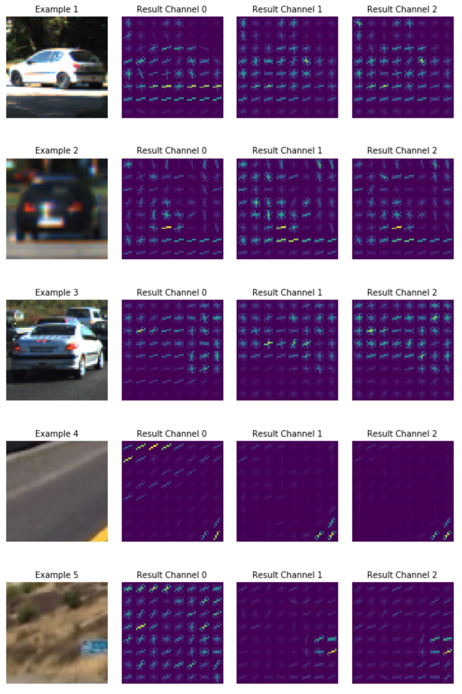
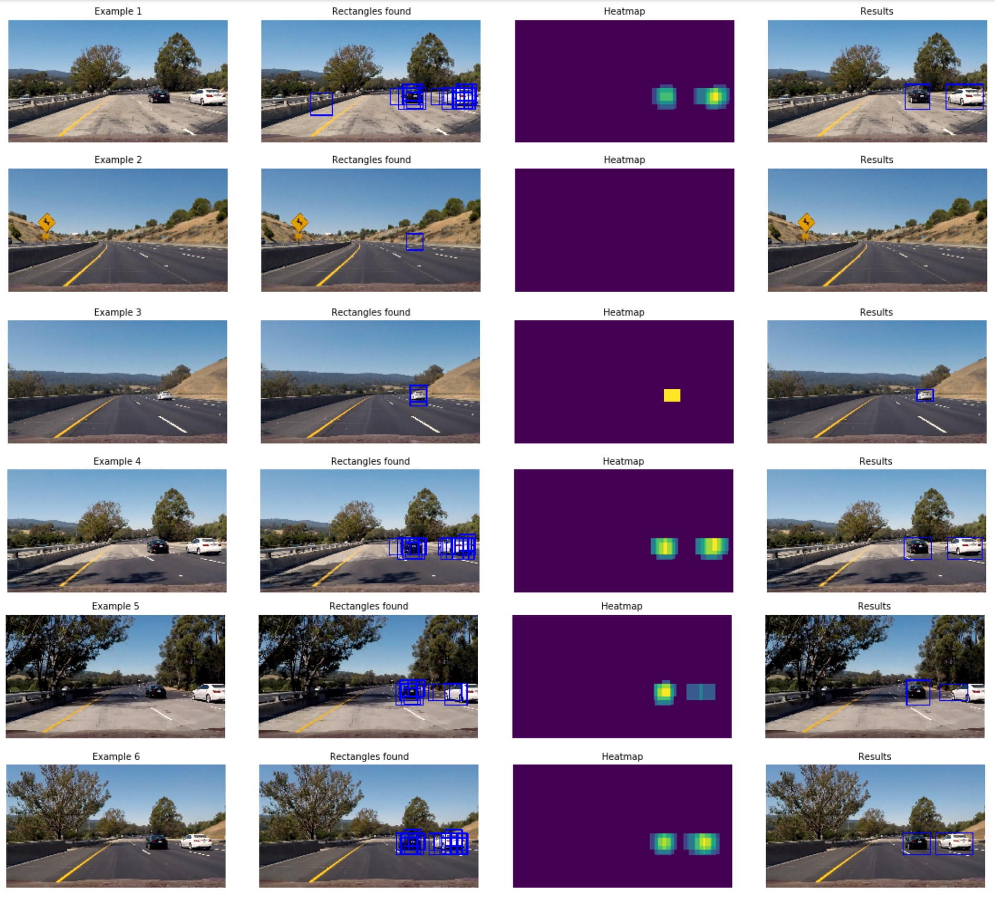

** Vehicle Detection Project **

The goals / steps of this project were the following:

* Perform a Histogram of Oriented Gradients (HOG) feature extraction on a labeled training set of images and train a classifier Linear SVM classifier
* Optionally, you can also apply a color transform and append binned color features, as well as histograms of color, to your HOG feature vector. 
* Note: for those first two steps don't forget to normalize your features and randomize a selection for training and testing.
* Implement a sliding-window technique and use your trained classifier to search for vehicles in images.
* Run your pipeline on a video stream (start with the test_video.mp4 and later implement on full project_video.mp4) and create a heat map of recurring detections frame by frame to reject outliers and follow detected vehicles.
* Estimate a bounding box for vehicles detected.

---
### Writeup / README

#### 1. Provide a Writeup / README that includes all the rubric points and how you addressed each one.  You can submit your writeup as markdown or pdf.  [Here](https://github.com/udacity/CarND-Vehicle-Detection/blob/master/writeup_template.md) is a template writeup for this project you can use as a guide and a starting point.  

You're reading it!

### Histogram of Oriented Gradients (HOG)

#### 1. Explain how (and identify where in your code) you extracted HOG features from the training images.

I started by read in all the training images. I also downloaded the Udacity training data and extracted all the vehicle images as well as created additional non-vehicle images (more on that later).

For extracting the HOG features I used the udacity example functions. The big task here was to decide which color space and parameters to use. I tried several different parameter sets and color representations which I evaluated both visually and numerically (by training and testing the SVM classifier). 

I explored different color spaces and different `skimage.hog()` parameters (`orientations`, `pixels_per_cell`, and `cells_per_block`).  I grabbed random images from each of the two classes and displayed them to get a feel for what the `skimage.hog()` output looks like.

#### 2. Explain how you settled on your final choice of HOG parameters.

I tried various combinations of parameters and validated them both visually and by fitting an SVM classifier. The good feature set should enable the classifier to be both accurate and fast. I evaluated several different combinations:
YCrCb/13/16 = 94.89, 0.0225
YCrCb/13/8 = 94.17, 0.021
HLS/13/16 = 94.93, 0.017
YUV/13/16 = 94.18, 0.02

Based on my results, I intially set the parameters to `orientations = 13` and `pix_per_cell = 16` which gave good results on the test set but gave poor results on the test images. It usually detected the back of the car but not the sides. So I ended up using the `YCrCb` color space with `orientations=9` and `pixels_per_cell=8`. This gave me a feature vector of size 7644.

An example of my final parameter set (`YCrCb` color space and HOG parameters of `orientations=13`, `pixels_per_cell=(8, 8)` and `cells_per_block=(2, 2)`) on both vehicle and non-vehicle images:

#### 3. Describe how (and identify where in your code) you trained a classifier using your selected HOG features (and color features if you used them).

My primary goal was to get a fast and reliable classifier. Of course, some tradeoffs had to be made. I examined both the linear and rbf kernel SVMs with multiple C values. The rbf kernel was significantly slower and only marginally better on my test set so I decided to use the linear kernel which (through its high fitting speed) enabled to evaluate multiple feature sets. 

The training data contained several images from the same car. In order to prevent overfitting (and be able to recognize it) I did not split the data randomly but I used the first 80% of both the car/non-car images for training and the rest 20-20 percent for testing. This made sure that the testing data is independent from the training data.

For the feature extraction I used the `extract_features` function from the classroom material which can be found in `library_functions.py`

My final result on the test set was 94.85% and the evaluation speed is 0.02 seconds for 100 evaluations (0.0002 per evaluation). Unfortunately, this matters very little as the feature vector extraction is several magnitudes slower. But more on that later.

### Sliding Window Search

#### 1. Describe how (and identify where in your code) you implemented a sliding window search.  How did you decide what scales to search and how much to overlap windows?

My sliding window search is based on the classroom code. I experimented a lot with the scaling factor and found the 1.5 scaling generally the most useful. As the HOG feature extraction is very slow if done in all search windows independently I calculated them only once and then sub-sampled them. 

The implementation is part of my `Detector()` class: the function is called `find_boxes` and it returns all the extracted rectangles. The function at the moment shows all the different combinations I evaluated (with different cut and scaling parameters). The modified find_cars function (which is part of the `library_functions.py`) accepts both `color_space` and `hog_channel` parameters (analog to the `extract_features` function) and the found rectangles is appended to the input list of `rectangles`. This enables multiple function calls after each other.

As for the overlapping, I found the 2x2 stepping the best as (using 8 cells and 8 pixels per cell) it enables 75% overlapping which helps localizing the cars more accurate as it creates a much smoother boundary.

#### 2. Show some examples of test images to demonstrate how your pipeline is working.  What did you do to optimize the performance of your classifier?

The working of my pipeline can be seen on the following test images:

First, I localize the cars using sliding windows with two scales on the `YCrCb` converted images. Then, using the resulting rectangles, a heatmap is created. This heatmap is thresholded with `threshold=1` and labeled using the `scipy.ndimage.measurements.label` function. These labels are then converted to rectangles and indicate the locations of the detected cars.

The performance of the classifier has two aspects: first, it needs to reliably detect the cars and give the least possible false negative results. Second, it has to run fast. Unfortunately, these two aspects have different requirements. I found that for reaching higher accuracy, a bigger feature vector is needed and more windows have to be evaluated. But both of these result a significantly slower performance. This means, a tradeoff has to be made. I limited a the size of the feature vector by using only HOG features and used only two scalings (1.5 and 2.0). This gave me rather balanced results on the test images with only a few false positive detections and a moderate speed of 3 frames per second (more about that in the video section)

---

### Video Implementation

#### 1. Provide a link to your final video output.  Your pipeline should perform reasonably well on the entire project video (somewhat wobbly or unstable bounding boxes are ok as long as you are identifying the vehicles most of the time with minimal false positives.)

Here's a [link to my video result](./output.mp4)

#### 2. Describe how (and identify where in your code) you implemented some kind of filter for false positives and some method for combining overlapping bounding boxes.

The video processing pipeline is similar to the single-image pipeline but there is a substantional difference between the two: I run the image processing pipeline on all frames of the video but the result of a given frame is calculated using some previous foundings as well.

The function is called `process_video()` and it calculates the local single-frame results and adds them to a list (`self.boxes_list`). This list acts like a memory and helps to stabilize the between-frame results (normally a car should appear on multiple frames but noise is usually scattered).

As length of the "memory" I empirically chose 15 (it is a parameter and was tuned carefully on the given video stream). The created multi-frame heatmap is thresholded with a value of 4. The result of the thresholding is then labeled with the `scipy.ndimage.measurements.label` function and resulting boundaries are drawn on the frame.

The results can be seen in my video.
---

### Discussion

#### 1. Briefly discuss any problems / issues you faced in your implementation of this project.  Where will your pipeline likely fail?  What could you do to make it more robust?

I faced many issues in my implementation of this project, I personally think it was the most challenging of them all. The design of the feature vectors is not straightforward and it is really hard to imagine what the results of a single parameter change might be. 

I also tried to use a lot more training data but it did not help at all on the video stream (but probably would have helped if using different cameras, locations etc) because it was created on a city location and the project video is a highway location. But from this I think I learned something useful.

The current implementation, albeit functional on the project video, will likely fail on most other locations, lightning conditions etc. With more tuning of the video processing and using more data for the training this could be improved.

It is also not real-time. At the moment it runs at about 3 FPS. This could be improved it the current HOG-SVM configuration, but not by an order of magnitude (which would be necessary). A parallel implementation, although, might help a bit.

A state-of-the-art convolutional neural network is capable of reaching more than 60FPS, I think I would rather continue the development in that direction.

